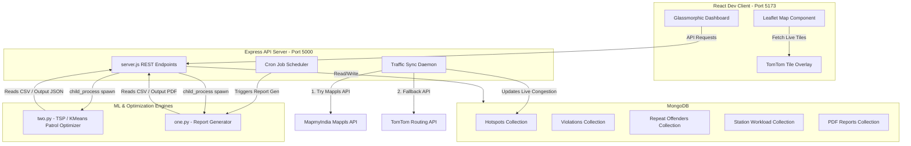

# 🚨 Bengaluru Traffic Patrol & Parking Hotspot Inspector
### Data-Driven Targeted Enforcement, Dynamic Patrol Routing, & Automated Monthly Reporting System

An advanced, full-stack MERN (MongoDB, Express, React, Node.js) application integrated with Python-driven Machine Learning and Geospatial Optimization. Built to manage traffic patrol routing, analyze parking violation clusters, track repeat offenders, generate monthly enforcement PDFs, and monitor live road congestion across Bengaluru.

---

## 🗺️ System Architecture



---

## ⚡ Core Features

### 1. 🗺️ Hotspot Visualization & Analysis
- **Dynamic Leaflet Map**: Rendered in a sleek, custom dark-mode style. Sizer radius scale dynamically maps to $\sqrt{\text{impact\_score}}$ and colors transition from Neon Cyan (low severity) to Orange and Deep Crimson Red (high severity/anomaly).
- **TomTom Live Layers**: Toggleable overlays showing real-time road conditions directly on the Leaflet map:
  - **Traffic Flow Layer**: Color-coded road segments (Green: Free flow, Yellow: Slow, Red: Heavy delay).
  - **Traffic Incidents Layer**: Live icons displaying accidents, construction, and traffic bottlenecks.
- **Click-to-Focus Interactions**: Clicking on any hotspot card centers the map, focuses on the area, and loads recent violation lists.

### 2. 🚦 Live Congestion Synchronization & Fallback System
- **Background Cron Engine**: Runs every 10 minutes to sync real-world traffic data for top 20 hotspot positions.
- **Dual API Support (MapmyIndia / TomTom)**:
  - **MapmyIndia (Primary)**: Authenticates via OAuth 2.0 Client Credentials and queries Mappls' distance matrix API to evaluate travel speed between hotspots and points 500m north.
  - **TomTom (Fallback)**: If MapmyIndia credentials are absent or fail, the system automatically uses TomTom Routing API to query trip durations and computes the corresponding speed in km/h.
- **Traffic Multipliers**: Updates the database with real-time congestion statuses (Low: $speed \ge 20 \text{ km/h}$, Moderate: $speed \in [12, 20) \text{ km/h}$, Heavy: $speed < 12 \text{ km/h}$).

### 3. 🚔 Patrol Route Optimizer (`two.py`)
- **K-Means Clustering**: Assigns hotspots to a designated number of police officers based on geographic proximity.
- **Traveling Salesperson Problem (TSP)**: Uses the Nearest-Neighbour heuristic to structure the shortest route sequence for each officer.
- **Shift & Congestion Aware Routing**: Supports `morning`, `afternoon`, `evening`, and `night` windows, applying live speed/dwell time multipliers based on time-of-day traffic levels.
- **Detailed Patrol Briefings**: Produces structured briefings with exact ETAs, dwell durations, and coordinates in `.csv`, `.json`, and a print-ready `.txt` format.

### 4. 📄 Automated Monthly Reports (`one.py`)
- **Monthly PDF Compilation**: Automatically generates professional police station reports including violation trend charts, top hotspot locations, severity stats, and repeat offender statistics.
- **MongoDB Storage**: Converts generated PDFs into binary `Buffer` objects, enabling users to download or review old documents directly from the dashboard.
- **On-Demand Generation**: Run PDF generation for any police station, year, and month with a single click.

### 5. 🚗 Repeat Offender Registry & Workload Analysis
- **Offender Registry**: Filterable, paginated search interface to look up vehicle license plates associated with frequent violations.
- **Station Workloads**: Side-by-side bar charts depicting jurisdiction-level hotspot counts and relative enforcement backlogs.
- **Severity Model Validation**: Interactive reporting of statistical T-Test validation to check if the severity weights align with physical coordinates.

---

## 📂 Project Directory Structure

```
c:\New folder (14)\
├── backend/                       # Node.js + Express REST API Server
│   ├── models.js                  # Mongoose models (Hotspot, Violation, Report, etc.)
│   ├── seed.js                    # High-speed streaming CSV data loader
│   ├── server.js                  # Core API routing, schedulers, and sync logic
│   └── package.json
│
├── frontend/                      # React Dev Client
│   ├── src/
│   │   ├── components/
│   │   │   ├── MapComponent.jsx   # Map container, circles & TomTom overlay controllers
│   │   │   ├── DetailPanel.jsx    # Selected hotspot details, trends, and charts
│   │   │   ├── PatrolRoutes.jsx   # Officer routing trigger UI & visual routes
│   │   │   └── ReportDashboard.jsx# PDF report generation, search & download UI
│   │   ├── App.jsx                # Layout shell & navigation tabs
│   │   ├── index.css              # Custom premium glassmorphic CSS rules
│   │   └── main.jsx
│   ├── index.html
│   ├── vite.config.js
│   └── package.json
│
├── one.py                         # Report Engine (PDF, pandas, reportlab)
├── two.py                         # Patrol Routing Engine (KMeans, TSP, scikit-learn)
├── requirements.txt               # Python package manifest
├── hotspots_with_road_context_v3.csv # Hotspot raw coordinates
├── violations_scored (1).csv      # Violations raw records
├── repeat_offenders.csv           # Repeated offenders list
├── station_load.csv               # Station capacity & backlog
└── .env.example                   # Shared template for local configurations
```

---

## 🔧 Environment Configurations

### 1. Backend Config (`backend/.env`)
Create `backend/.env` containing:
```env
MONGO_URI=mongodb+srv://<username>:<password>@cluster0.mongodb.net/parking_db
PORT=5000
FRONTEND_URL=http://localhost:5173
PYTHON_PATH=python
MAPMYINDIA_CLIENT_ID=your_mappls_client_id
MAPMYINDIA_CLIENT_SECRET=your_mappls_client_secret
```

### 2. Frontend Config (`frontend/.env`)
Create `frontend/.env` containing:
```env
VITE_API_URL=http://localhost:5000
VITE_TOMTOM_KEY=your_tomtom_api_key
```

---

## 🚀 Installation & Local Launch

### Step 1: Install Dependencies
1. **Python packages**:
   ```bash
   pip install -r requirements.txt
   ```
2. **Backend Node packages**:
   ```bash
   cd backend
   npm install
   ```
3. **Frontend Node packages**:
   ```bash
   cd ../frontend
   npm install
   ```

### Step 2: Seed the Database (Run Once)
To load the CSV data into MongoDB using memory-efficient streams:
```bash
cd ../backend
node seed.js
```

### Step 3: Start the Backend REST Server
```bash
npm run dev # or: node server.js
```
The backend server will run on `http://localhost:5000` and trigger an initial traffic sync within 5 seconds.

### Step 4: Launch the Frontend Web Interface
```bash
cd ../frontend
npm run dev
```
Open your browser and navigate to `http://localhost:5173`.

---

## 📡 REST API Documentation

### Hotspots
- **`GET /api/hotspots`**: Lists hotspot clusters.
  - *Query Params*: `limit` (Number), `police_station` (String).
- **`GET /api/hotspots/:id/violations`**: Returns individual violations within a specific hotspot.
  - *Query Params*: `vehicle_type` (String) for sub-filtering.

### Patrol Optimizer
- **`POST /api/patrol-routes`**: Generates optimized routes for patrolling officers.
  - *Body*: `{ station: string, officersCount: number, hotspotsCount: number, shift: string }`.

### PDF Reports
- **`GET /api/reports`**: Fetches all available PDF report metadata.
- **`GET /api/reports/:id/download`**: Streams the PDF binary file for browser download.
- **`POST /api/reports/generate`**: Runs `one.py` dynamically to build and store a new report.
  - *Body*: `{ station: string, year: number, month: number }`.

### Repeat Offenders & Meta Information
- **`GET /api/repeat-offenders`**: Retrieves a paginated list of repeat parking offenders.
  - *Query Params*: `page` (Number), `limit` (Number).
- **`GET /api/station-load`**: Returns jurisdiction workloads.
- **`GET /api/severity-calibration`**: Returns statistics validating impact severity metrics.
- **`GET /api/meta`**: Returns metadata options (lists of police stations, vehicle types, general stats).

---

## ⚖️ License
MIT License. Created & Optimized by Jai, 2026.
