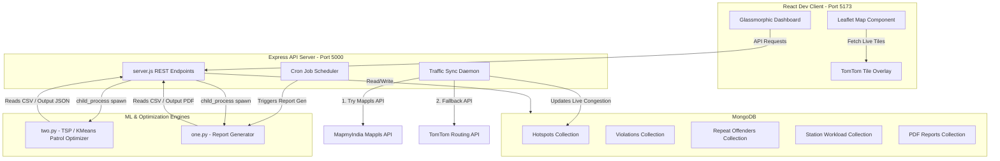
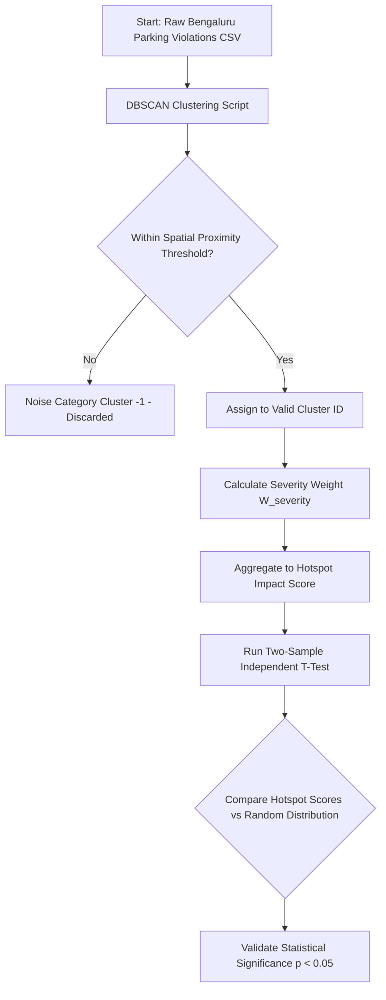
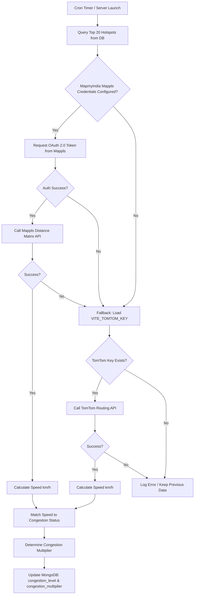
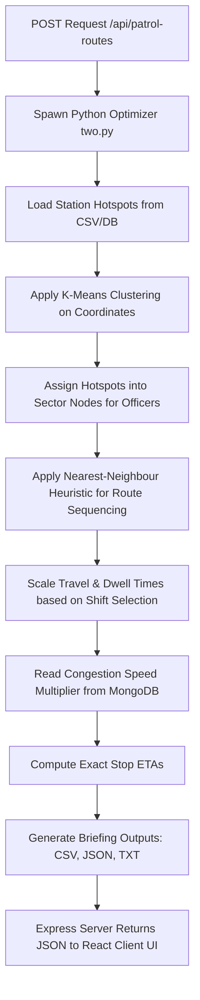
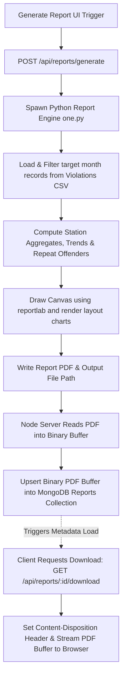
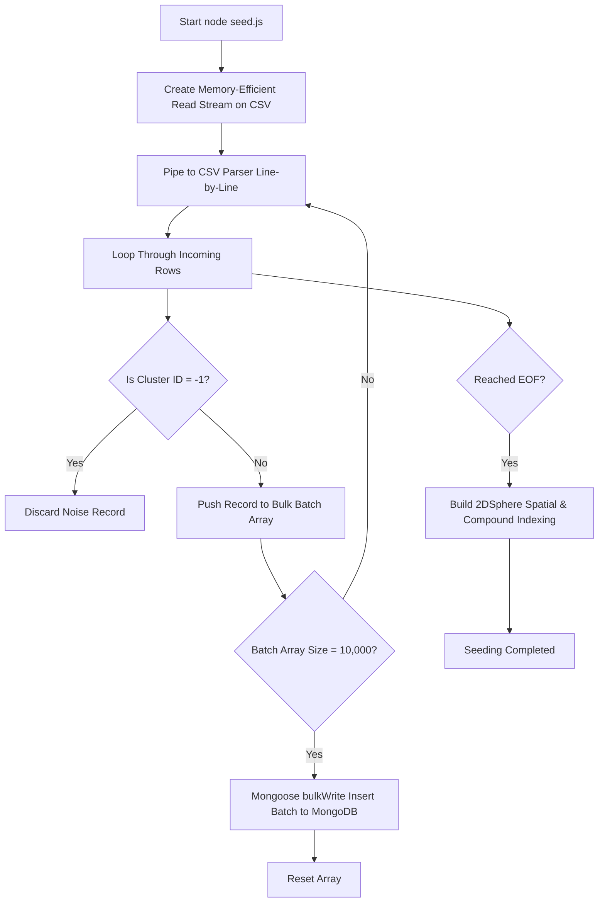
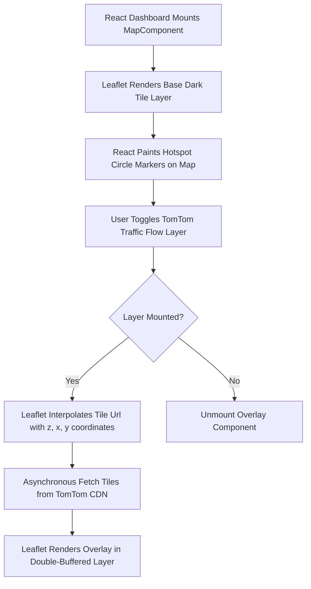

# 🚨 Bengaluru Traffic Patrol & Parking Hotspot Inspector
### Data-Driven Targeted Enforcement, Dynamic Patrol Routing, & Automated Monthly Reporting System

An advanced, full-stack MERN (MongoDB, Express, React, Node.js) application integrated with Python-driven Machine Learning and Geospatial Optimization. Built to manage traffic patrol routing, analyze parking violation clusters, track repeat offenders, generate monthly enforcement PDFs, and monitor live road congestion across Bengaluru.

---

## 🗺️ System Architecture



---

## ⚡ Core Features

### 1. 🗺️ Hotspot Visualization & Analysis
- **Dynamic Leaflet Map**: Rendered in a sleek, custom dark-mode style. Sizer radius scale dynamically maps to $\sqrt{\text{impact\_score}}$ and colors transition from Neon Cyan (low severity) to Orange and Deep Crimson Red (high severity/anomaly).
- **TomTom Live Layers**: Toggleable overlays showing real-time road conditions directly on the Leaflet map:
  - **Traffic Flow Layer**: Color-coded road segments (Green: Free flow, Yellow: Slow, Red: Heavy delay).
  - **Traffic Incidents Layer**: Live icons displaying accidents, construction, and traffic bottlenecks.
- **Click-to-Focus Interactions**: Clicking on any hotspot card centers the map, focuses on the area, and loads recent violation lists.

### 2. 🚦 Live Congestion Synchronization & Fallback System
- **Background Cron Engine**: Runs every 10 minutes to sync real-world traffic data for top 20 hotspot positions.
- **Dual API Support (MapmyIndia / TomTom)**:
  - **MapmyIndia (Primary)**: Authenticates via OAuth 2.0 Client Credentials and queries Mappls' distance matrix API to evaluate travel speed between hotspots and points 500m north.
  - **TomTom (Fallback)**: If MapmyIndia credentials are absent or fail, the system automatically uses TomTom Routing API to query trip durations and computes the corresponding speed in km/h.
- **Traffic Multipliers**: Updates the database with real-time congestion statuses (Low: $speed \ge 20 \text{ km/h}$, Moderate: $speed \in [12, 20) \text{ km/h}$, Heavy: $speed < 12 \text{ km/h}$).

### 3. 🚔 Patrol Route Optimizer (`two.py`)
- **K-Means Clustering**: Assigns hotspots to a designated number of police officers based on geographic proximity.
- **Traveling Salesperson Problem (TSP)**: Uses the Nearest-Neighbour heuristic to structure the shortest route sequence for each officer.
- **Shift & Congestion Aware Routing**: Supports `morning`, `afternoon`, `evening`, and `night` windows, applying live speed/dwell time multipliers based on time-of-day traffic levels.
- **Detailed Patrol Briefings**: Produces structured briefings with exact ETAs, dwell durations, and coordinates in `.csv`, `.json`, and a print-ready `.txt` format.

### 4. 📄 Automated Monthly Reports (`one.py`)
- **Monthly PDF Compilation**: Automatically generates professional police station reports including violation trend charts, top hotspot locations, severity stats, and repeat offender statistics.
- **MongoDB Storage**: Converts generated PDFs into binary `Buffer` objects, enabling users to download or review old documents directly from the dashboard.
- **On-Demand Generation**: Run PDF generation for any police station, year, and month with a single click.

### 5. 🚗 Repeat Offender Registry & Workload Analysis
- **Offender Registry**: Filterable, paginated search interface to look up vehicle license plates associated with frequent violations.
- **Station Workloads**: Side-by-side bar charts depicting jurisdiction-level hotspot counts and relative enforcement backlogs.
- **Severity Model Validation**: Interactive reporting of statistical T-Test validation to check if the severity weights align with physical coordinates.

- **Severity Model Validation**: Interactive reporting of statistical T-Test validation to check if the severity weights align with physical coordinates.

---

## 🛠️ Detailed Technical Workflows & Data Pipelines

### Workflow 1: Geospatial Hotspot Clustering & Severity Model Validation Pipeline



1. **Clustering Analysis**: High-density parking violations are grouped using DBSCAN within Python ML scripts. Points are evaluated based on coordinate proximity, generating distinct geographic hotspot clusters. Noise points are assigned to cluster `-1` and discarded to focus resources.
2. **Severity Weighting Model**: Each violation is processed using calibrated weights ($W_{severity}$) representing safety hazard levels and road congestion impacts. An overall hotspot impact score is calculated by:
     $$\text{Impact Score} = \sum_{i=1}^{N} W_i \cdot M_{\text{temporal}}$$
3. **Statistical T-Test Validation**: To prove the clustering model is statistically significant, the system performs a Two-Sample Independent T-Test, comparing the severity scores of violation records inside cluster boundaries against a randomized distribution of points across Bengaluru. A low $p$-value ($p < 0.05$) validates that the identified hotspots represent statistically distinct areas of elevated traffic disruptions rather than random distributions.

---

### Workflow 2: Dynamic Live Congestion Sync & Multi-API Fallback Routing Loop



1. **Initiation**: The Express backend runs a cron job scheduler every 10 minutes to verify traffic conditions on the closest roads to the hotspots.
2. **MapmyIndia Integration**: The backend attempts authentication at Mappls OAuth servers. On success, it calls the Mappls distance matrix API between the hotspot center ($Lat_1, Lon_1$) and a waypoint $500\text{m}$ north ($Lat_1+0.005, Lon_1$).
3. **TomTom Fallback Execution**: If MapmyIndia credentials fail or are rate-limited, the handler falls back to TomTom, querying `https://api.tomtom.com/routing/1/calculateRoute` for the coordinate segment.
4. **Calculations and Database Updates**: Speed is derived from the parsed route length and travel duration:
     $$\text{Speed (km/h)} = \frac{\text{LengthInMeters} / 1000}{\text{TravelTimeInSeconds} / 3600}$$
   Congestion parameters are updated in the MongoDB `Hotspots` collection:
     - **Low Congestion** ($\ge 20\text{ km/h}$): Multiplier = $1.0$
     - **Moderate Congestion** ($12 \text{ to } 20\text{ km/h}$): Multiplier = $1.2$
     - **Heavy Congestion** ($< 12\text{ km/h}$): Multiplier = $1.5$

---

### Workflow 3: Multi-Agent TSP Patrol Optimization & Shift-Aware Scheduling Engine



1. **Parameter Submission**: The frontend sends the target police station, officer count ($K$), hotspot threshold ($N$), and shift selection (`morning`, `afternoon`, `evening`, `night`) via a POST request to `/api/patrol-routes`.
2. **K-Means Geographic Partitioning**: The node backend spawns a Python process running `two.py` with these arguments. The script loads coordinates for the top $N$ hotspots inside the selected station's area, then applies **K-Means Clustering** to partition these hotspots into $K$ separate sectors (one for each officer).
3. **Traveling Salesperson Problem (TSP) Solving**: For each officer's assigned cluster, the script computes the optimal routing sequence using the Nearest-Neighbour heuristic. The path planning starts at the centroid of the partition, greedily visiting the closest unvisited hotspot.
4. **Shift and Congestion Delay Adjustments**: Travel times and station dwell times are scaled dynamically depending on the selected shift. Traffic speeds are adjusted based on active congestion levels retrieved from the database, scaling transit durations by the multiplier (e.g. $1.5\times$ travel delay for heavy areas).
5. **Output Delivery**: The script compiles the results into CSV, JSON, and flat-text formats, writing them to disk and outputting details to standard output where they are read, parsed, and rendered as path lines on the UI.

---

### Workflow 4: PDF Compilation Engine & MongoDB Binary Storage Lifecycle



1. **Triggering Generation**: The user selects a station, year, and month, and clicks "Generate Report".
2. **Asynchronous Report Compiling**: The backend spawns a child process running `one.py`. The script loads the target month's data from `violations_scored (1).csv`, aggregates total occurrences, segments violation categories, and counts repeat offenders.
3. **Layout Rendering**: Using Python's `reportlab` canvas, the script outputs a high-resolution PDF document, rendering dynamic header banners, statistical tables, and vector trend charts mapping month-over-month violation trajectories. The finished PDF path is printed to stdout.
4. **Database Binary Upsert**: Node reads the PDF file from the disk into a Node `Buffer`. It upserts the document in the MongoDB `reports` collection, saving the binary buffer in the `pdfData` field (handling files safely).
5. **Streaming Download Response**: When a user requests a download via `GET /api/reports/:id/download`, the server retrieves the document, sets HTTP response headers to control file downloads (`Content-Type: application/pdf`, `Content-Disposition: attachment`), and streams the buffer back to the browser.

---

### Workflow 5: High-Speed Memory-Efficient CSV Streaming & Database Seeding Pipeline



1. **Resource Constraints Handling**: Seeding datasets of over 240,000 records requires careful memory management to avoid Node heap exhaustion.
2. **Streaming and Parsing**: In `backend/seed.js`, a readable stream (`fs.createReadStream`) is piped directly to `csv-parser`. Records are processed line-by-line as data chunks arrive in the buffer.
3. **Batch Insertion & Filtering**: The seeder filters out records with `cluster_id = -1` (noise/non-hotspot events). Valid records are pushed to a temporary array. Once the array hits a chunk size of `10,000` documents, the seeder uses Mongoose `bulkWrite` to perform an optimized bulk insert.
4. **Index Creation**: Following data insertion, the script builds database indexes: 2D Sphere index on `avg_lat`/`avg_lon` coordinates to accelerate spatial queries, and compound indexes on key query pathways like `{ police_station: 1, rank_v3: 1 }`.

---

### Workflow 6: Double-Buffered Leaflet Layer Toggling & Render Event Loop



1. **Map Rendering Context**: The React UI mounts the Leaflet `MapContainer` centered on Bengaluru coordinates. Circles indicating hotspot boundaries are painted on the canvas using React state arrays.
2. **Tile Layer Event Handling**: The UI provides checkboxes to toggle TomTom overlays. Checking the box mounts a nested Leaflet `TileLayer` component that requests map tiles dynamically from TomTom's CDN.
3. **Tile URL Interpolation**: The tile requests are interpolated using `{z}`, `{x}`, and `{y}` coordinates: `https://api.tomtom.com/traffic/map/4/tile/flow/relative0/{z}/{x}/{y}.png?key={VITE_TOMTOM_KEY}`.
4. **Asynchronous Tile Fetching**: Leaflet manages tile updates in the background, downloading and rendering new graphics as the user pans or zooms. This ensures the UI remains responsive and the main thread is never blocked.

---

## 📂 Project Directory Structure

```
c:\New folder (14)\
├── backend/                       # Node.js + Express REST API Server
│   ├── models.js                  # Mongoose models (Hotspot, Violation, Report, etc.)
│   ├── seed.js                    # High-speed streaming CSV data loader
│   ├── server.js                  # Core API routing, schedulers, and sync logic
│   └── package.json
│
├── frontend/                      # React Dev Client
│   ├── src/
│   │   ├── components/
│   │   │   ├── MapComponent.jsx   # Map container, circles & TomTom overlay controllers
│   │   │   ├── DetailPanel.jsx    # Selected hotspot details, trends, and charts
│   │   │   ├── PatrolRoutes.jsx   # Officer routing trigger UI & visual routes
│   │   │   └── ReportDashboard.jsx# PDF report generation, search & download UI
│   │   ├── App.jsx                # Layout shell & navigation tabs
│   │   ├── index.css              # Custom premium glassmorphic CSS rules
│   │   └── main.jsx
│   ├── index.html
│   ├── vite.config.js
│   └── package.json
│
├── one.py                         # Report Engine (PDF, pandas, reportlab)
├── two.py                         # Patrol Routing Engine (KMeans, TSP, scikit-learn)
├── requirements.txt               # Python package manifest
├── hotspots_with_road_context_v3.csv # Hotspot raw coordinates
├── violations_scored (1).csv      # Violations raw records
├── repeat_offenders.csv           # Repeated offenders list
├── station_load.csv               # Station capacity & backlog
└── .env.example                   # Shared template for local configurations
```

---

## 🔧 Environment Configurations

### 1. Backend Config (`backend/.env`)
Create `backend/.env` containing:
```env
MONGO_URI=mongodb+srv://<username>:<password>@cluster0.mongodb.net/parking_db
PORT=5000
FRONTEND_URL=http://localhost:5173
PYTHON_PATH=python
MAPMYINDIA_CLIENT_ID=your_mappls_client_id
MAPMYINDIA_CLIENT_SECRET=your_mappls_client_secret
```

### 2. Frontend Config (`frontend/.env`)
Create `frontend/.env` containing:
```env
VITE_API_URL=http://localhost:5000
VITE_TOMTOM_KEY=your_tomtom_api_key
```

---

## 🚀 Installation & Local Launch

### Step 1: Install Dependencies
1. **Python packages**:
   ```bash
   pip install -r requirements.txt
   ```
2. **Backend Node packages**:
   ```bash
   cd backend
   npm install
   ```
3. **Frontend Node packages**:
   ```bash
   cd ../frontend
   npm install
   ```

### Step 2: Seed the Database (Run Once)
To load the CSV data into MongoDB using memory-efficient streams:
```bash
cd ../backend
node seed.js
```

### Step 3: Start the Backend REST Server
```bash
npm run dev # or: node server.js
```
The backend server will run on `http://localhost:5000` and trigger an initial traffic sync within 5 seconds.

### Step 4: Launch the Frontend Web Interface
```bash
cd ../frontend
npm run dev
```
Open your browser and navigate to `http://localhost:5173`.

---

## 📡 REST API Documentation

### Hotspots
- **`GET /api/hotspots`**: Lists hotspot clusters.
  - *Query Params*: `limit` (Number), `police_station` (String).
- **`GET /api/hotspots/:id/violations`**: Returns individual violations within a specific hotspot.
  - *Query Params*: `vehicle_type` (String) for sub-filtering.

### Patrol Optimizer
- **`POST /api/patrol-routes`**: Generates optimized routes for patrolling officers.
  - *Body*: `{ station: string, officersCount: number, hotspotsCount: number, shift: string }`.

### PDF Reports
- **`GET /api/reports`**: Fetches all available PDF report metadata.
- **`GET /api/reports/:id/download`**: Streams the PDF binary file for browser download.
- **`POST /api/reports/generate`**: Runs `one.py` dynamically to build and store a new report.
  - *Body*: `{ station: string, year: number, month: number }`.

### Repeat Offenders & Meta Information
- **`GET /api/repeat-offenders`**: Retrieves a paginated list of repeat parking offenders.
  - *Query Params*: `page` (Number), `limit` (Number).
- **`GET /api/station-load`**: Returns jurisdiction workloads.
- **`GET /api/severity-calibration`**: Returns statistics validating impact severity metrics.
- **`GET /api/meta`**: Returns metadata options (lists of police stations, vehicle types, general stats).

---

## ⚖️ License
MIT License. Created & Optimized by Jai, 2026.
