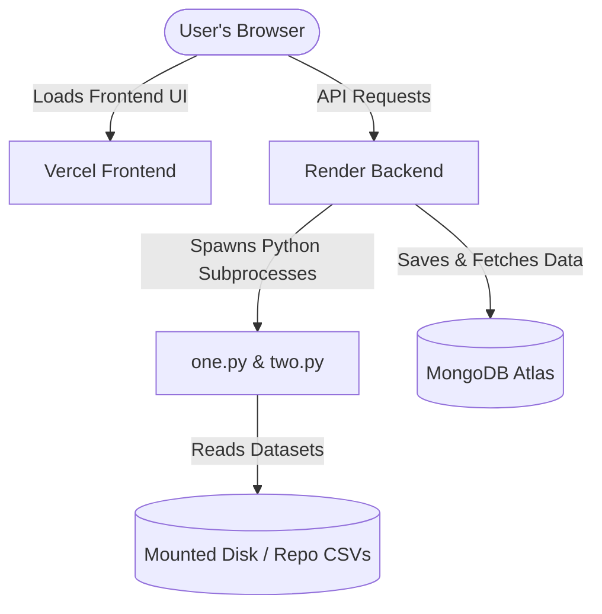

# 🚀 Deployment Guide — Vercel & Render

This guide outlines the steps to deploy the **Parking Violations Hotspot Inspector** application, including the React frontend to Vercel and the Node.js + Express backend (which runs the Python analytics scripts) to Render.

---

## 🗺️ Deployment Overview

---

## 📦 Prerequisites

1. A **GitHub Repository** containing the project.
2. A **MongoDB Atlas** account with a database cluster set up.
3. Accounts on **[Render](https://render.com)** (for backend) and **[Vercel](https://vercel.com)** (for frontend).

---

## 🛠️ Step 1: MongoDB Atlas Setup
1. Create a cluster on MongoDB Atlas.
2. Go to **Network Access** and add IP `0.0.0.0/0` (or configure to allow access from all IPs, as Render's dynamic IPs change frequently).
3. Go to **Database Access** and create a user database account with read/write access.
4. Copy the connection string. It will look like this:
   `mongodb+srv://<username>:<password>@cluster.mongodb.net/parking_db`

---

## 🚘 Step 2: Deploy Backend to **Render**

The backend is configured to install Node.js dependencies, compile your environment, and execute `pip3 install -r ../requirements.txt` automatically during the build step.

### 🛠️ Render Web Service Setup (Manual)
1. Log in to the **[Render Dashboard](https://dashboard.render.com/)**.
2. Click **New +** at the top right and select **Web Service**.
3. Connect your GitHub repository.
4. Configure the following settings:
   * **Name**: `parking-hotspot-backend`
   * **Root Directory**: `backend`
   * **Runtime**: `Node`
   * **Build Command**: `npm run build`
   * **Start Command**: `npm start`
5. Expand the **Advanced** section and add the following Environment Variables:
   * `NODE_ENV` = `production`
   * `PORT` = `5000`
   * `MONGO_URI` = `mongodb+srv://...` (Your MongoDB Atlas connection string)
   * `FRONTEND_URL` = `https://your-vercel-app-url.vercel.app` (Your Vercel URL, update this once Vercel gives you one)
   * `PYTHON_PATH` = `python3`
6. Click **Create Web Service**.

---

### 📂 Handling Large CSV Files on Render

Because large files (like `violations_scored (1).csv`) are excluded from Git:
1. In the Render Dashboard under your backend service, navigate to **Disks** and click **Add Disk**.
2. Set the **Mount Path** to `/data` and size to `1 GB` (or larger depending on your dataset sizes).
3. Upload your `.csv` dataset files (specifically `violations_scored (1).csv` and `hotspots_with_road_context_v3.csv`) directly to this mounted `/data` directory.
4. Go to **Environment** settings for the service and add:
   * `DATA_DIR` = `/data`
5. Save changes. The python scripts will now dynamically load datasets from `/data`.

---

## 🎨 Step 3: Deploy Frontend to **Vercel**

1. Log in to the **[Vercel Dashboard](https://vercel.com/)**.
2. Click **Add New** -> **Project** and select your GitHub repository.
3. In the project setup screen, configure the following:
   * **Root Directory**: Select `frontend`
   * **Framework Preset**: `Vite` (Detected automatically)
   * **Build Command**: `npm run build`
   * **Output Directory**: `dist`
4. Under **Environment Variables**, add:
   * `VITE_API_URL`: Your Render Web Service live URL (e.g., `https://parking-hotspot-backend.onrender.com`).
5. Click **Deploy**.

---

## 🔗 Step 4: Link CORS Policies

1. Copy the live frontend domain generated by Vercel (e.g., `https://your-app.vercel.app`).
2. Go to the **Render Dashboard**, open your backend Web Service, and select the **Environment** tab.
3. Change the value of `FRONTEND_URL` to match your Vercel domain exactly.
4. Save the changes. Render will automatically redeploy the service, allowing secure frontend-backend communication.
